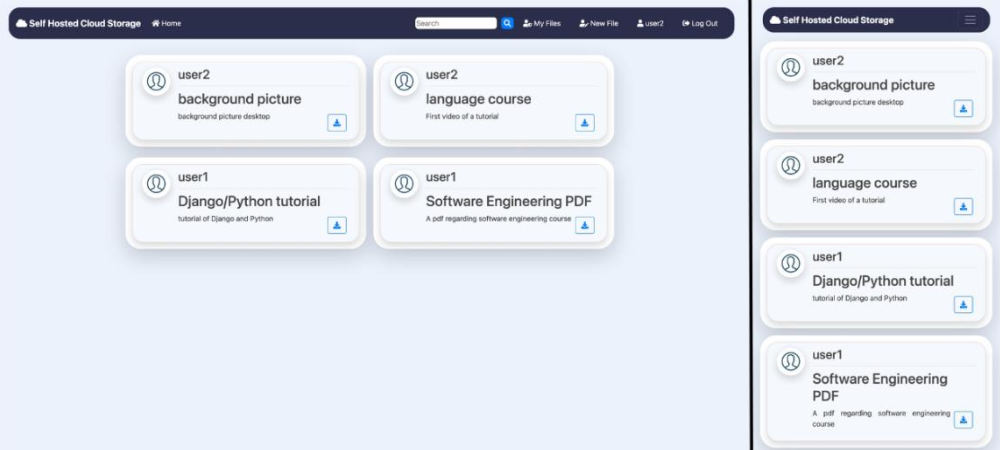

# CloudVault

Self-hosted cloud storage built with Django. Upload, manage, download, and organize files on your own machine.

**Author:** [Rakesh](https://github.com/rakeshrakhi9392)



## Features

- User authentication (register, login, logout, profile)
- File upload, download, preview, update, and delete
- Search by title, content, or author
- Responsive UI for desktop and mobile
- Django admin for user management

## Tech Stack

- **Backend:** Python 3.12+, Django 4.2
- **Database:** SQLite
- **Frontend:** Django Templates, Bootstrap 4, Crispy Forms
- **Other:** Pillow (profile images)

## Installation

### Prerequisites

- Python 3.12 or higher
- Virtual environment (recommended)

1. **Clone the repository**:
    ```bash
    git clone https://github.com/rakeshrakhi9392/CloudVault.git
    cd CloudVault
    ```

2. **Create and activate a virtual environment**:

    **On macOS/Linux:**
    ```bash
    python3 -m venv venv
    source venv/bin/activate
    ```

    **On Windows:**
    ```cmd
    python -m venv venv
    venv\Scripts\activate
    ```

3. **Install the dependencies**:
    ```bash
    pip install -r requirements.txt
    ```

4. **Go to the Django project folder**:
    ```bash
    cd Self-Hosted/file-management-system-using-django-main
    ```

### Set Up the Database

```bash
python manage.py migrate
```

### Run the Server

```bash
python manage.py runserver
```

Open `http://127.0.0.1:8000` in your browser.

### Create an Admin User (optional)

```bash
python manage.py createsuperuser
```

Use the admin account at `/admin/` to manage users.

## Usage

1. Register an account and log in.
2. Click **New File** to upload.
3. Use **My Files** to view your uploads.
4. Download, update, or delete files from the detail page.

## Project Structure

```
CloudVault/
├── README.md
├── requirements.txt
└── Self-Hosted/
    └── file-management-system-using-django-main/
        ├── manage.py
        ├── blog/          # file management
        ├── users/         # auth & profiles
        └── django_web_app/
```

## License

See [LICENSE](LICENSE) for details.
